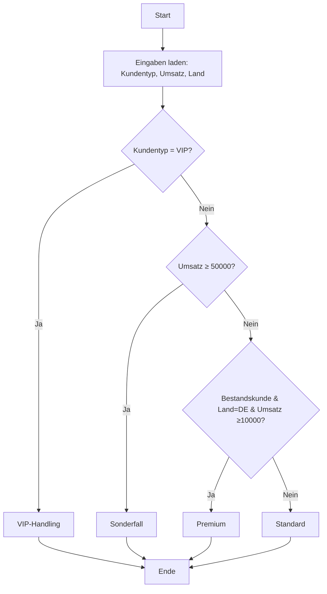

# Universelle Entscheidungsmatrix – Anleitung

## [.SYSTEMS.T.SYSTEMS.] Entscheidungsmatrix-System

### Überblick

Die Entscheidungsmatrix ist ein universelles System zur systematischen Erfassung aller Möglichkeiten. Es kann auf fast jedes Thema angewendet werden:

- **Bugs & Code-Fehler**: Fehlertyp, Schweregrad, Priorität → Lösung
- **Kundenlogik**: Kundentyp, Umsatz, Land → Rabattstufe
- **Preislogik**: Produkt, Menge, Kunde → Preis
- **Rabatte**: Status, Bestellwert, Treue → Rabatt
- **Prozesse**: Eingang, Typ, Priorität → Workflow
- **Workflows**: Schritt, Status, Bedingung → Nächster Schritt
- **Systeme**: Komponente, Status, Kontext → Aktion

### 1. Grundprinzip: "Alle Möglichkeiten" systematisch erfassen

#### Vorgehen

1. **Alle Einflussfaktoren auflisten**
   - Parameter A (z.B. Kundentyp, Bug-Typ, Status)
   - Parameter B (z.B. Umsatz, Priorität, Schweregrad)
   - Parameter C (z.B. Land, Datum, Laufzeit)

2. **Alle möglichen Ausprägungen je Faktor erfassen**
   - Kundentyp: Neu, Bestandskunde, VIP
   - Bug-Typ: Syntax, Logik, Performance
   - Status: Offen, In Bearbeitung, Geschlossen

3. **Regeln definieren**
   - *Wenn* Bedingung X **und** Y, *dann* Ergebnis Z
   - Möglichst in "Wenn… dann… sonst…"-Sätzen formulieren
   - Alles in eine "Regeltabelle" schreiben

4. **Logik standardisieren**
   - **Keine** Logik "im Kopf" lassen
   - Alles entweder in:
     - eine **Entscheidungsmatrix (Excel-Tabelle)** oder
     - ein **Flowchart mit Entscheidungsknoten** gießen

### 2. Excel-Logik: Beispielaufbau mit Formeln

#### Struktur als Entscheidungsmatrix

| Regel-ID | Kundentyp | Umsatz ≥ | Land | Ergebnis     |
| -------- | --------- | -------- | ---- | ------------ |
| R1       | Neu       | 0        | *    | Standard     |
| R2       | Bestands  | 10000    | DE   | Premium      |
| R3       | VIP       | 0        | *    | VIP-Handling |
| R4       | *         | 50000    | *    | Sonderfall   |

`*` = "egal / beliebig"

#### Variante 1: Mit FILTER/XLOOKUP (moderne Excel)

**Hilfsspalten** in der Regeltabelle, z.B. Spalte F: "Regel passt?"

In `F2` (erste Regelzeile):

```excel
=UND(
   ODER([@Kundentyp]="*"; [@Kundentyp]=$B$2);
   [@Umsatz ≥] <= $C$2;
   ODER([@Land]="*"; [@Land]=$D$2)
)
```

Dann in `E2` (Ausgabe):

```excel
=INDEX([Ergebnis-Spalte]; VERGLEICH(WAHR; [Spalte_mit_Regel_passt]; 0))
```

oder mit `XLOOKUP`:

```excel
=XLOOKUP(WAHR; [Spalte_mit_Regel_passt]; [Ergebnis-Spalte]; "Keine passende Regel")
```

#### Variante 2: Klassische verschachtelte WENN-Formeln

```excel
=WENN(UND(B2="VIP"; C2>=0); "VIP-Handling";
WENN(UND(B2="Bestands"; C2>=10000; D2="DE"); "Premium";
WENN(C2>=50000; "Sonderfall";
"Standard")))
```

#### Variante 3: Scoring-/Punktelogik (wenn viele Kriterien)

| Kriterium    | Gewicht | Wert (Input) | Punkte |
| ------------ | ------- | ------------ | ------ |
| Kundentyp    | 3       | VIP          | 3      |
| Umsatzklasse | 2       | > 50k        | 2      |
| Land-Risiko  | 1       | niedrig      | 1      |

Gesamtpunkte:

```excel
=SUMMENPRODUKT( Gewicht_Bereich ; Punkte_Bereich )
```

Und dann:

```excel
=WENN(Gesamtpunkte>=5; "Top-Kunde";
WENN(Gesamtpunkte>=3; "Mittel";
"Standard"))
```

### 3. Flowchart-Aufbereitung (Logik visualisieren)

#### Pseudocode

```
[Start]
   ↓
[Eingaben laden: Kundentyp, Umsatz, Land]
   ↓
{Kundentyp = "VIP"?}
   ├─ Ja → [VIP-Handling] → [Ende]
   └─ Nein →
        {Umsatz ≥ 50000?}
           ├─ Ja → [Sonderfall] → [Ende]
           └─ Nein →
                {Kundentyp="Bestands" UND Land="DE" UND Umsatz≥10000?}
                   ├─ Ja → [Premium] → [Ende]
                   └─ Nein → [Standard] → [Ende]
```

#### Mermaid-Syntax



### 4. Anwendung auf Bugs & Code-Fehler

#### Beispiel: Bug-Fix-System

**Faktoren:**
- **A**: Fehlertyp (Syntax, Logik, Performance, Security)
- **B**: Schweregrad (Kritisch, Hoch, Mittel, Niedrig)
- **C**: Komponente (Frontend, Backend, Database, API)

**Ausprägungen:**
- Fehlertyp: Syntax, Logik, Performance, Security
- Schweregrad: Kritisch, Hoch, Mittel, Niedrig
- Komponente: Frontend, Backend, Database, API

**Regeln:**
- R1: Syntax + Kritisch → Sofort-Fix
- R2: Security + * → Security-Review
- R3: Performance + Hoch + Frontend → Performance-Optimierung
- R4: Logik + Mittel → Code-Review

**Excel-Formel:**

```excel
=WENN(UND(A2="Syntax"; B2="Kritisch"); "Sofort-Fix";
WENN(UND(A2="Security"; WAHR); "Security-Review";
WENN(UND(A2="Performance"; B2="Hoch"; C2="Frontend"); "Performance-Optimierung";
WENN(UND(A2="Logik"; B2="Mittel"); "Code-Review";
"Standard-Fix"))))
```

### 5. Integration in TogetherSystems

Die Entscheidungsmatrix ist vollständig in das TogetherSystems Complete Package integriert:

- **App**: `apps/decision-matrix.html`
- **Auto-Save**: Speichert automatisch in localStorage
- **Export**: JSON, Excel-Formeln, Mermaid
- **Integration**: Kann mit anderen Apps kommunizieren

### 6. Verwendung

1. **Öffne** `apps/decision-matrix.html`
2. **Definiere** Faktoren und Ausprägungen
3. **Erstelle** Regeln
4. **Teste** mit Eingaben
5. **Exportiere** Excel-Formeln oder Mermaid-Flowchart
6. **Integriere** in dein System

### [.SYSTEMS.T.SYSTEMS.]

BRANÐ: TTT.T,.3T | Kennung: [.T.4T.]
