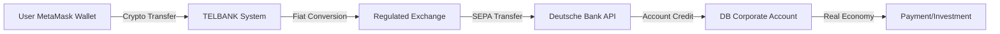

# Deutsche Bank Integration – Vollständige Spezifikation

**LOGO:** `T,.&T,,.&T,,,.(C)TEL1.NL`  
**VERSION:** 1.0.0-XXXL-DB-INTEGRATION  
**STANDARD:** IBM Industrial Fabrication Software Machine  
**DATUM:** 2025-01-15  
**STATUS:** Prototyp-Bereit für Deutsche Bank Partnerschaft  

---

## 🏦 ÜBERSICHT

### Zielsetzung
Integration der **Deutsche Bank AG** als **Hauptbank-Partner** für Together Systems, speziell für:
- TPGA Telbank → Deutsche Bank Geldfluss
- Crypto ↔ Fiat Umtausch (via regulierte Exchanges)
- Negative Assets Management
- Compliance & Reporting (BaFin)
- KYC/AML-Prozesse
- API-basierte Transaktionen

### Strategische Position
- **Deutsche Bank** = Hauptbank-Partner (seit 40+ Jahren Kundenbeziehung des Initiators)
- **Peladia Bank** = Zweitbank (Tokai-do-System)
- **TELBANK** = Erste Bank (zeitverifiziert)
- **MetaMask** = Einzige Wallet für Wechselkursaktionen

---

## 📡 API-INTEGRATION

### 1. Deutsche Bank API Overview

#### 1.1 Verfügbare APIs

**Deutsche Bank API Portal:**
- **Sandbox:** `https://api-sandbox.db.com`
- **Production:** `https://api.db.com`
- **Documentation:** `https://developer.db.com`

#### 1.2 API-Kategorien

##### A. Account Information Services (AIS)
```json
{
  "base_url": "https://api.db.com/v2/ais",
  "endpoints": {
    "accounts": "/accounts",
    "balances": "/accounts/{accountId}/balances",
    "transactions": "/accounts/{accountId}/transactions",
    "account_details": "/accounts/{accountId}"
  },
  "authentication": "OAuth 2.0 / PSD2",
  "scopes": ["ais:accounts:read", "ais:transactions:read"]
}
```

##### B. Payment Initiation Services (PIS)
```json
{
  "base_url": "https://api.db.com/v2/pis",
  "endpoints": {
    "payment_initiation": "/payments",
    "payment_status": "/payments/{paymentId}/status",
    "payment_cancellation": "/payments/{paymentId}/cancellation",
    "bulk_payments": "/bulk-payments"
  },
  "authentication": "OAuth 2.0 / PSD2",
  "scopes": ["pis:payments:create"]
}
```

##### C. Corporate Banking API
```json
{
  "base_url": "https://api.db.com/v1/corporate",
  "endpoints": {
    "cash_management": "/cash-management",
    "trade_finance": "/trade-finance",
    "foreign_exchange": "/fx",
    "liquidity": "/liquidity"
  },
  "authentication": "Certificate-based (mTLS)",
  "certificate_required": true
}
```

##### D. Trade Finance API
```json
{
  "base_url": "https://api.db.com/v1/trade",
  "endpoints": {
    "letters_of_credit": "/letters-of-credit",
    "guarantees": "/guarantees",
    "export_financing": "/export-financing"
  },
  "authentication": "Certificate-based (mTLS)"
}
```

---

## 🔐 AUTHENTICATION & ZERTIFIKATE

### 2. Certificate Management

#### 2.1 Zertifikats-Anforderungen

**Für Corporate Banking API (mTLS):**
```yaml
certificate_type: "X.509 Client Certificate"
format: "PEM oder PKCS#12"
key_size: "RSA 2048 bit minimum (RSA 4096 empfohlen)"
validity_period: "1-3 Jahre"
issuer: "Deutsche Bank Certificate Authority oder akkreditierte CA"
subject_dn: "CN={Company Name}, O={Organization}, C={Country}"
key_usage: "Digital Signature, Key Encipherment"
extended_key_usage: "Client Authentication"
```

#### 2.2 Zertifikats-Erstellung (Prototyp-Phase)

**Schritt 1: Certificate Signing Request (CSR) generieren**
```bash
# RSA 4096 bit private key generieren
openssl genrsa -out db-client-key.pem 4096

# CSR generieren
openssl req -new -key db-client-key.pem -out db-client.csr \
  -subj "/CN=Together Systems/O=TEL1.NL/C=NL"
```

**Schritt 2: CSR an Deutsche Bank senden**
- Via Partner Portal oder direkter Kontakt zu Corporate Banking
- Deutsche Bank stellt signiertes Zertifikat aus

**Schritt 3: Zertifikat in System integrieren**
```javascript
// Certificate Storage (sicher)
const certificateConfig = {
  clientCert: fs.readFileSync('db-client-cert.pem'),
  clientKey: fs.readFileSync('db-client-key.pem'),
  caCert: fs.readFileSync('db-ca-cert.pem'), // Deutsche Bank CA
  passphrase: process.env.CERT_PASSPHRASE // Aus sicherer Quelle
};
```

#### 2.3 OAuth 2.0 für PSD2 APIs (AIS/PIS)

```json
{
  "grant_type": "authorization_code",
  "client_id": "DEUTSCHE_BANK_CLIENT_ID",
  "client_secret": "DEUTSCHE_BANK_CLIENT_SECRET",
  "redirect_uri": "https://togethersystems.com/auth/callback",
  "scope": "ais:accounts:read pis:payments:create",
  "authorization_endpoint": "https://api.db.com/oauth/authorize",
  "token_endpoint": "https://api.db.com/oauth/token"
}
```

---

## 💼 COMPLIANCE & REGULATORIK

### 3. BaFin-Anforderungen

#### 3.1 PSD2-Compliance

**Payment Services Directive 2 (PSD2):**
- ✅ Strong Customer Authentication (SCA)
- ✅ Regulatory Technical Standards (RTS)
- ✅ Third-Party Provider (TPP) Registrierung
- ✅ API-Zugang für AIS/PIS

**Deutsche Bank PSD2 API:**
- EIDAS-konformes Zertifikat erforderlich
- TPP-Identifikation via QWAC/QSEAL
- SCA via Redirect oder Embedded Flow

#### 3.2 KYC/AML-Prozesse

**Know Your Customer (KYC):**
```json
{
  "kyc_level": "Enhanced Due Diligence",
  "requirements": [
    "Firmenidentität (Handelsregister)",
    "Geschäftsführer-Identität (Ausweis)",
    "Geschäftstätigkeit-Beschreibung",
    "Erwartete Transaktionsvolumen",
    "Herkunft der Mittel (Source of Funds)",
    "Zweck der Geschäftsbeziehung"
  ],
  "ongoing_monitoring": true,
  "review_frequency": "Jährlich oder bei Änderungen"
}
```

**Anti-Money Laundering (AML):**
- ✅ Transaktions-Monitoring (suspicious activity reporting)
- ✅ Sanctions Screening (UN/EU/US Sanctions Lists)
- ✅ PEP-Screening (Politically Exposed Persons)
- ✅ Risk Assessment (low/medium/high risk customer)

#### 3.3 Reporting-Anforderungen

**BaFin-Meldepflichten:**
- Großbetragsanzeigen (> €15.000)
- Verdachtsanzeigen (suspicious transactions)
- Jährliche Risikobewertung

**Deutsche Bank Reporting:**
- Automatisches Reporting via API möglich
- CSV/XML-Export für manuelle Meldungen

---

## 🔄 INTEGRATION-ARCHITEKTUR

### 4. System-Integration

#### 4.1 TELBANK → Deutsche Bank Flow



#### 4.2 API-Integration Layer

**Cloudflare Workers Function:**
```javascript
// functions/api/deutsche-bank/client.js
export class DeutscheBankClient {
  constructor(config) {
    this.baseUrl = config.environment === 'production' 
      ? 'https://api.db.com' 
      : 'https://api-sandbox.db.com';
    this.certificate = config.certificate;
    this.clientId = config.clientId;
    this.clientSecret = config.clientSecret;
  }

  async initiatePayment(paymentData) {
    // mTLS für Corporate Banking API
    const response = await fetch(`${this.baseUrl}/v1/corporate/payments`, {
      method: 'POST',
      headers: {
        'Content-Type': 'application/json',
        'X-Request-ID': crypto.randomUUID()
      },
      body: JSON.stringify(paymentData),
      // Certificate-based authentication
      cf: {
        clientTlsAuth: {
          cert: this.certificate.clientCert,
          key: this.certificate.clientKey
        }
      }
    });
    return response.json();
  }

  async getAccountBalance(accountId) {
    // OAuth 2.0 für PSD2 AIS API
    const token = await this.getOAuthToken();
    const response = await fetch(
      `${this.baseUrl}/v2/ais/accounts/${accountId}/balances`,
      {
        headers: {
          'Authorization': `Bearer ${token}`,
          'X-Request-ID': crypto.randomUUID()
        }
      }
    );
    return response.json();
  }

  async getOAuthToken() {
    // OAuth 2.0 token refresh logic
    // ...
  }
}
```

#### 4.3 D1 Database Schema für Deutsche Bank Integration

```sql
-- Deutsche Bank Accounts
CREATE TABLE IF NOT EXISTS deutsche_bank_account (
  account_id TEXT PRIMARY KEY,
  iban TEXT UNIQUE NOT NULL,
  bic TEXT,
  account_name TEXT,
  account_type TEXT CHECK (account_type IN ('current', 'savings', 'corporate')),
  currency TEXT(3) NOT NULL DEFAULT 'EUR',
  status TEXT CHECK (status IN ('active', 'suspended', 'closed')),
  created_at TEXT NOT NULL DEFAULT (datetime('now')),
  updated_at TEXT NOT NULL DEFAULT (datetime('now'))
);

-- Deutsche Bank Transactions
CREATE TABLE IF NOT EXISTS deutsche_bank_transaction (
  transaction_id TEXT PRIMARY KEY,
  account_id TEXT NOT NULL REFERENCES deutsche_bank_account(account_id),
  external_ref TEXT, -- Deutsche Bank Transaction ID
  amount REAL NOT NULL,
  currency TEXT(3) NOT NULL,
  direction TEXT CHECK (direction IN ('credit', 'debit')),
  counterparty_iban TEXT,
  counterparty_name TEXT,
  payment_reference TEXT,
  transaction_date TEXT NOT NULL,
  value_date TEXT,
  status TEXT CHECK (status IN ('pending', 'completed', 'failed', 'cancelled')),
  metadata_json TEXT, -- JSON für zusätzliche Daten
  created_at TEXT NOT NULL DEFAULT (datetime('now'))
);

-- Deutsche Bank API Logs (Audit)
CREATE TABLE IF NOT EXISTS deutsche_bank_api_log (
  log_id TEXT PRIMARY KEY,
  endpoint TEXT NOT NULL,
  method TEXT NOT NULL,
  request_id TEXT,
  status_code INTEGER,
  request_body TEXT,
  response_body TEXT,
  error_message TEXT,
  timestamp TEXT NOT NULL DEFAULT (datetime('now'))
);

-- Indexes
CREATE INDEX idx_db_transaction_account ON deutsche_bank_transaction(account_id);
CREATE INDEX idx_db_transaction_date ON deutsche_bank_transaction(transaction_date);
CREATE INDEX idx_db_api_log_timestamp ON deutsche_bank_api_log(timestamp);
```

---

## 💰 GELDFLUSS-INTEGRATION

### 5. Crypto ↔ Fiat via Deutsche Bank

#### 5.1 Inflow (Fiat → Crypto → MetaMask)

**Flow:**
1. User überweist EUR via SEPA auf Deutsche Bank Corporate Account
2. Deutsche Bank API meldet eingehende Transaktion
3. System konvertiert EUR → ETH/Stablecoin via regulierte Exchange
4. Crypto wird an MetaMask-Wallet gesendet

**API-Implementation:**
```javascript
async function handleFiatInflow(dbTransaction) {
  // 1. Transaktion von Deutsche Bank empfangen
  const creditAmount = dbTransaction.amount; // EUR
  
  // 2. Exchange Order: EUR → ETH
  const exchangeOrder = await createExchangeOrder({
    from: 'EUR',
    to: 'ETH',
    amount: creditAmount,
    exchange: 'REGULATED_EXCHANGE_NAME'
  });
  
  // 3. Warte auf Exchange-Ausführung
  const cryptoAmount = await waitForExchangeCompletion(exchangeOrder.id);
  
  // 4. Transfer zu MetaMask Wallet
  await transferToMetaMask({
    amount: cryptoAmount,
    currency: 'ETH',
    walletAddress: userMetaMaskAddress
  });
  
  // 5. Log in TELBANK System
  await logTelbankFlow({
    direction: 'in',
    fiatAmount: creditAmount,
    fiatCurrency: 'EUR',
    cryptoAmount: cryptoAmount,
    cryptoSymbol: 'ETH',
    source: 'Deutsche Bank',
    dbTransactionId: dbTransaction.transaction_id
  });
}
```

#### 5.2 Outflow (MetaMask → Crypto → Fiat → Deutsche Bank)

**Flow:**
1. User sendet Crypto von MetaMask an Exchange
2. Exchange konvertiert Crypto → EUR
3. System initiiert SEPA-Überweisung via Deutsche Bank API
4. Fiat wird auf Deutsche Bank Account gutgeschrieben

**API-Implementation:**
```javascript
async function handleCryptoOutflow(cryptoAmount, targetIBAN) {
  // 1. Crypto von MetaMask an Exchange senden
  const exchangeDeposit = await depositToExchange({
    amount: cryptoAmount,
    currency: 'ETH'
  });
  
  // 2. Exchange: ETH → EUR
  const exchangeOrder = await createExchangeOrder({
    from: 'ETH',
    to: 'EUR',
    amount: cryptoAmount,
    exchange: 'REGULATED_EXCHANGE_NAME'
  });
  
  const fiatAmount = await waitForExchangeCompletion(exchangeOrder.id);
  
  // 3. SEPA-Überweisung via Deutsche Bank API
  const payment = await deutscheBankClient.initiatePayment({
    creditorAccount: {
      iban: targetIBAN
    },
    instructedAmount: {
      currency: 'EUR',
      amount: fiatAmount.toString()
    },
    remittanceInformationUnstructured: 'Together Systems TPGA Telbank Withdrawal',
    requestedExecutionDate: new Date().toISOString().split('T')[0]
  });
  
  // 4. Log in TELBANK System
  await logTelbankFlow({
    direction: 'out',
    fiatAmount: fiatAmount,
    fiatCurrency: 'EUR',
    cryptoAmount: cryptoAmount,
    cryptoSymbol: 'ETH',
    destination: 'Deutsche Bank',
    dbPaymentId: payment.paymentId
  });
}
```

---

## 🔒 SICHERHEIT & BEST PRACTICES

### 6. Security Measures

#### 6.1 Certificate Storage
- ✅ Zertifikate in Cloudflare Workers Secrets oder Vault
- ✅ Private Keys niemals in Code oder Git
- ✅ Zertifikats-Rotation (alle 1-2 Jahre)
- ✅ Certificate Revocation List (CRL) prüfen

#### 6.2 API Security
- ✅ Rate Limiting (Deutsche Bank Limits beachten)
- ✅ Request ID Tracking (X-Request-ID Header)
- ✅ Idempotency Keys für Payments
- ✅ TLS 1.3 für alle Verbindungen
- ✅ IP Whitelisting (wenn verfügbar)

#### 6.3 Data Protection
- ✅ GDPR-konforme Datenverarbeitung
- ✅ PII-Verschlüsselung (at rest & in transit)
- ✅ Audit-Logging aller API-Calls
- ✅ Data Retention Policies

---

## 📊 MONITORING & ERROR HANDLING

### 7. Error Handling

#### 7.1 Deutsche Bank API Error Codes

```javascript
const DB_ERROR_CODES = {
  'DB001': 'Invalid certificate',
  'DB002': 'Certificate expired',
  'DB003': 'Insufficient funds',
  'DB004': 'Invalid IBAN',
  'DB005': 'Account not found',
  'DB006': 'Transaction limit exceeded',
  'DB007': 'KYC verification required',
  'DB008': 'AML check failed',
  'DB009': 'Rate limit exceeded',
  'DB010': 'Service temporarily unavailable'
};

async function handleDeutscheBankError(error) {
  const errorCode = error.code;
  
  switch (errorCode) {
    case 'DB001':
    case 'DB002':
      // Certificate-Problem → Alert Admin, Certificate erneuern
      await alertAdmin('Certificate issue detected');
      break;
    case 'DB003':
      // Insufficient funds → User informieren
      return { success: false, message: 'Insufficient funds in account' };
    case 'DB007':
      // KYC required → KYC-Prozess starten
      await triggerKYCProcess();
      break;
    case 'DB009':
      // Rate limit → Exponential Backoff
      await sleep(exponentialBackoff(retryCount));
      break;
    default:
      // Generic error → Log & Alert
      console.error('Deutsche Bank API Error:', error);
      await logError(error);
  }
}
```

#### 7.2 Retry Logic

```javascript
async function retryWithBackoff(fn, maxRetries = 3) {
  for (let i = 0; i < maxRetries; i++) {
    try {
      return await fn();
    } catch (error) {
      if (error.code === 'DB009' && i < maxRetries - 1) {
        // Rate limit → wait exponential
        await sleep(Math.pow(2, i) * 1000);
        continue;
      }
      throw error;
    }
  }
}
```

---

## 🚀 DEPLOYMENT & PRODUCTION-READINESS

### 8. Prototyp-Anforderungen

#### 8.1 Deutsche Bank Partner-Prozess

**Phase 1: Initial Contact**
- ✅ Kontakt zu Deutsche Bank Corporate Banking
- ✅ Geschäftskonzept präsentieren
- ✅ KYC/AML-Prozess starten

**Phase 2: Sandbox Access**
- ✅ API-Zugangsdaten für Sandbox erhalten
- ✅ Test-Zertifikate beantragen
- ✅ Sandbox-Integration testen

**Phase 3: Production Setup**
- ✅ Production-Zertifikate beantragen
- ✅ Production API-Credentials erhalten
- ✅ Go-Live mit kleineren Beträgen

#### 8.2 Checkliste für Production

- [ ] Deutsche Bank Corporate Account eröffnet
- [ ] KYC/AML-Prozess abgeschlossen
- [ ] Production-Zertifikate erhalten
- [ ] API-Credentials konfiguriert
- [ ] Sandbox-Tests erfolgreich
- [ ] Error-Handling implementiert
- [ ] Monitoring & Alerting eingerichtet
- [ ] Compliance-Dokumentation erstellt
- [ ] BaFin-Meldepflichten geklärt

---

## 📚 REFERENZEN & LINKS

### Deutsche Bank API Documentation
- **Developer Portal:** https://developer.db.com
- **PSD2 API Docs:** https://developer.db.com/psd2
- **Corporate Banking API:** https://developer.db.com/corporate-banking
- **Sandbox Environment:** https://api-sandbox.db.com

### Regulatory
- **BaFin:** https://www.bafin.de
- **PSD2 Regulation:** EU Directive 2015/2366
- **EIDAS:** https://eidas.europa.eu

### Together Systems Integration
- **TELBANK System:** `TELBANK/README.md`
- **TPGA Overview:** `TELBANK/TPGA-TELBANK-SYSTEM-OVERVIEW.md`
- **Master Documentation:** `GESAMTSYSTEM-MASTER-DOKUMENTATION.md`

---

**Erstellt:** 2025-01-15  
**Version:** 1.0.0-XXXL-DB-INTEGRATION  
**Branding:** T,.&T,,.&T,,,.(C)TEL1.NL  
**Status:** Prototyp-Bereit für Deutsche Bank Partnerschaft

