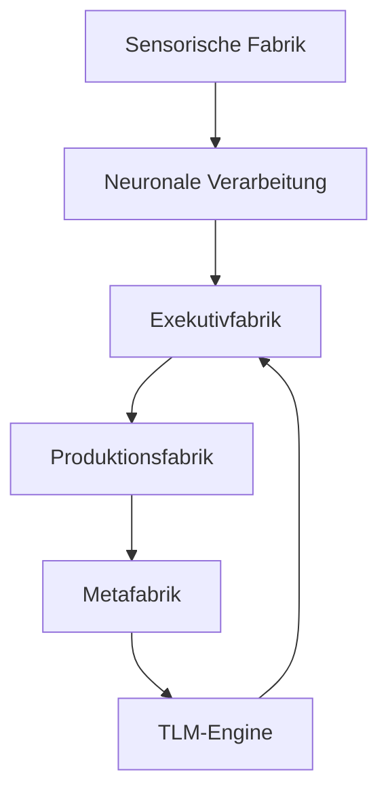
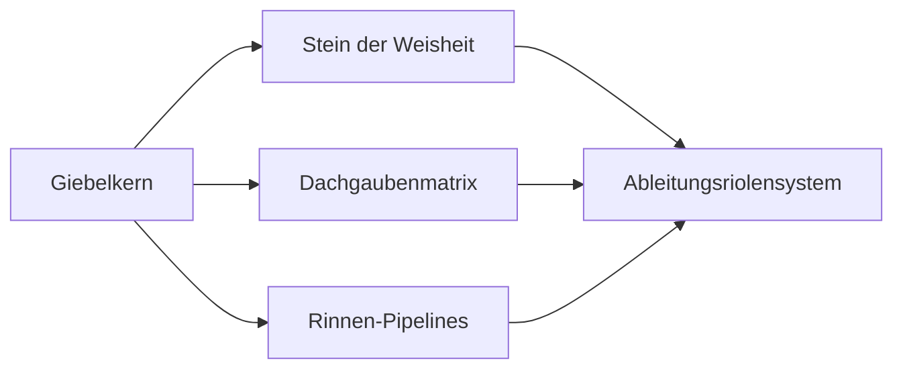
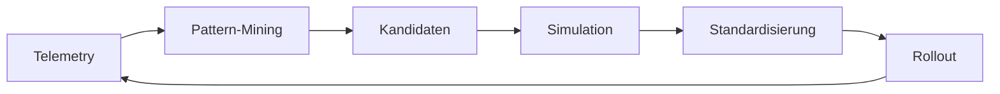

# 📊 VISUAL ARCHITECTURE: DIAGRAMME & VISUALISIERUNGEN
## Grafische Darstellung der TLM-FabrikOS Architektur

**VERSION:** 1.0.0-KERNEL-XXXL  
**STATUS:** 🔴 PERMANENT AKTIV - NIEMALS DEAKTIVIEREN

---

## 🏗️ ARCHITEKTUR-ÜBERSICHT (ASCII)

```
┌─────────────────────────────────────────────────────────────────────┐
│                    SCHICHT E: METAFABRIK                            │
│  ┌──────────────┐  ┌──────────────┐  ┌──────────────┐             │
│  │ Meta-Lernen  │  │ Optimierung  │  │ Pipeline-    │             │
│  │              │  │ 100%+++      │  │ Upgrade      │             │
│  └──────────────┘  └──────────────┘  └──────────────┘             │
│                           │                                          │
│                    ┌──────▼──────┐                                  │
│                    │ TLM-Engine  │                                  │
│                    └─────────────┘                                  │
└───────────────────────────┬─────────────────────────────────────────┘
                            │
┌───────────────────────────▼─────────────────────────────────────────┐
│              SCHICHT D: PRODUKTIONSFABRIK                            │
│  ┌──────────────┐  ┌──────────────┐  ┌──────────────┐             │
│  │ Sprachfabrik │  │ Motor-Fabrik │  │ Aktions-     │             │
│  │              │  │              │  │ Pipeline     │             │
│  └──────────────┘  └──────────────┘  └──────────────┘             │
└───────────────────────────┬─────────────────────────────────────────┘
                            │
┌───────────────────────────▼─────────────────────────────────────────┐
│              SCHICHT C: EXEKUTIVFABRIK                              │
│  ┌──────────────┐  ┌──────────────┐  ┌──────────────┐             │
│  │ Planungs-    │  │ Hemmungs-    │  │ Risiko-       │             │
│  │ zentrale     │  │ Mechanismen   │  │ Regelung      │             │
│  └──────────────┘  └──────────────┘  └──────────────┘             │
│                           │                                          │
│                    ┌──────▼──────┐                                  │
│                    │ Priorisierungs│                                 │
│                    │ kern          │                                 │
│                    └───────────────┘                                 │
└───────────────────────────┬─────────────────────────────────────────┘
                            │
┌───────────────────────────▼─────────────────────────────────────────┐
│        SCHICHT B: NEURONALE VERARBEITUNGSFABRIK                     │
│  ┌──────────────┐  ┌──────────────┐  ┌──────────────┐             │
│  │ Global       │  │ Assoziations-│  │ Gedächtnis-   │             │
│  │ Workspace    │  │ Matrix       │  │ werk          │             │
│  └──────────────┘  └──────────────┘  └──────────────┘             │
│         │                  │                  │                     │
│  ┌──────▼──────┐  ┌───────▼───────┐  ┌──────▼──────┐             │
│  │ Emotionale   │  │ Kontemplations-│  │            │             │
│  │ Bewertung    │  │ Module         │  │            │             │
│  └──────────────┘  └───────────────┘  └─────────────┘             │
└───────────────────────────┬─────────────────────────────────────────┘
                            │
┌───────────────────────────▼─────────────────────────────────────────┐
│              SCHICHT A: SENSORISCHE FABRIK                           │
│  ┌──────────┐  ┌──────────┐  ┌──────────┐  ┌──────────┐          │
│  │ Visuelle │  │ Auditive  │  │ Somato-   │  │ Intero-   │          │
│  │ Linie    │  │ Linie     │  │ sensorik  │  │ zeptive   │          │
│  └──────────┘  └──────────┘  └──────────┘  └──────────┘          │
│                           │                                          │
│                    ┌──────▼──────┐                                  │
│                    │ Exterozeptive│                                 │
│                    │ Trigger-Felder│                                │
│                    └───────────────┘                                 │
└─────────────────────────────────────────────────────────────────────┘
```

---

## 🧠 NEURAL CORE MAP (Verdrahtung)

```
                    ┌─────────────────┐
                    │  GIEBELKERN     │
                    │ (Top Control)   │
                    └────────┬────────┘
                             │
        ┌────────────────────┼────────────────────┐
        │                    │                    │
┌───────▼───────┐   ┌────────▼────────┐   ┌──────▼──────┐
│ Dachgauben-   │   │ Stein der       │   │ Rinnen-     │
│ Matrix        │   │ Weisheit        │   │ Pipelines   │
│ (Meta-Aware)  │   │ (Integrity)     │   │ (Waste Mgmt)│
└───────────────┘   └─────────────────┘   └─────────────┘
        │                    │                    │
        └────────────────────┼────────────────────┘
                             │
                    ┌────────▼────────┐
                    │ Ableitungs-     │
                    │ riolensystem    │
                    │ (Drainage)      │
                    └─────────────────┘
```

---

## 🔄 PRODUCTION LEARNING LOOP

```
┌──────────────┐
│  TELEMETRY   │
│   SAMMELN    │
└──────┬───────┘
       │
       ▼
┌──────────────┐
│ PATTERN-     │
│ MINING       │
└──────┬───────┘
       │
       ▼
┌──────────────┐
│ KANDIDATEN-  │
│ VORSCHLÄGE   │
└──────┬───────┘
       │
       ▼
┌──────────────┐
│ SIMULATION   │
│ / SANDBOX    │
└──────┬───────┘
       │
       ▼
┌──────────────┐
│ STANDARD-    │
│ ISIERUNG     │
└──────┬───────┘
       │
       ▼
┌──────────────┐
│ ROLLOUT      │
│ (Monitoring) │
└──────┬───────┘
       │
       └──────────┐
                  │
                  ▼
         (zurück zu TELEMETRY)
```

---

## 🗣️ TLM-WORKFLOW

```
INPUT
  │
  ▼
┌─────────────────┐
│ TLM-A: Thought  │
│ Primitives      │
└────────┬────────┘
         │
         ▼
┌─────────────────┐
│ TLM-B:          │
│ Interaction     │
│ Layers          │
└────────┬────────┘
         │
         ▼
┌─────────────────┐
│ TLM-C:          │
│ Narrative       │
│ Engines         │
└────────┬────────┘
         │
         ▼
┌─────────────────┐
│ TLM-D:          │
│ Harmonizer      │
└────────┬────────┘
         │
         ▼
      OUTPUT
```

---

## 🏛️ METAPHORISCHE ARCHITEKTUR

```
                    ┌─────────────┐
                    │   DACH      │
                    │ (TLM-Engine)│
                    └──────┬──────┘
                           │
        ┌──────────────────┼──────────────────┐
        │                  │                  │
┌───────▼──────┐   ┌───────▼──────┐   ┌──────▼──────┐
│   GAUBEN    │   │   GIEBEL     │   │   GAUBEN    │
│ (Plugins)   │   │ (Control)    │   │ (Extend)    │
└─────────────┘   └───────────────┘   └─────────────┘
        │                  │                  │
        └──────────────────┼──────────────────┘
                           │
                    ┌──────▼──────┐
                    │   WÄNDE     │
                    │ (Modules)   │
                    └──────┬──────┘
                           │
                    ┌──────▼──────┐
                    │  FUNDAMENT  │
                    │ (Standards) │
                    └─────────────┘
                           │
                    ┌──────▼──────┐
                    │   RINNEN    │
                    │ (Logs/Audit)│
                    └─────────────┘
```

---

## 📈 ERWEITERUNGSMECHANISMEN

```
┌─────────────────────────────────────────────────┐
│  ULTRA-PARALLELISIERUNG                         │
│  ┌────┐ ┌────┐ ┌────┐ ┌────┐ ┌────┐           │
│  │ M1 │ │ M2 │ │ M3 │ │ M4 │ │ M5 │ ...        │
│  └────┘ └────┘ └────┘ └────┘ └────┘           │
│     │      │      │      │      │              │
│     └──────┼──────┼──────┼──────┘              │
│            │      │      │                     │
│       ┌────▼──────▼──────▼────┐                │
│       │   Load Balancer        │                │
│       └────────────────────────┘                │
└─────────────────────────────────────────────────┘

┌─────────────────────────────────────────────────┐
│  AUTO-ROUTING                                   │
│                                                 │
│  Input → [Module A] → Überlast?                │
│              │                                  │
│              ├─→ [Module B] (Alternative)      │
│              │                                  │
│              └─→ [Module C] (Backup)           │
└─────────────────────────────────────────────────┘

┌─────────────────────────────────────────────────┐
│  SELBST-REPARATUR                               │
│                                                 │
│  Fehler erkannt                                 │
│       │                                         │
│       ▼                                         │
│  Auto-Healing aktiviert                         │
│       │                                         │
│       ▼                                         │
│  Backup-System aktiviert                        │
│       │                                         │
│       ▼                                         │
│  System wiederhergestellt                        │
└─────────────────────────────────────────────────┘
```

---

## 🎯 Mermaid-Diagramme (für draw.io, Mermaid)

### Architektur-Schichten:



### Neural Core Map:



### Production Learning Loop:



---

## 📊 KAPAZITÄTS-VISUALISIERUNG

```
LEISTUNG (%)
    │
200%│                    ╱───────────────
    │                  ╱
150%│                ╱
    │              ╱
100%│─────────────╱
    │          ╱
 50%│        ╱
    │      ╱
  0%│─────╱
    └───────────────────────────────────> ZEIT
     0    6    12   18   24   36 Monate

Legende:
  ─── Basis-Leistung (100%)
  ╱── Mit Erweiterungsmechanismen (100%+++)
```

---

## 🔗 VERBINDUNGS-MATRIX (Heatmap)

```
        │ A  │ B  │ C  │ D  │ E  │
    ────┼────┼────┼────┼────┼────┤
    A   │ -  │ ██ │    │    │    │
    ────┼────┼────┼────┼────┼────┤
    B   │ ██ │ -  │ ██ │    │    │
    ────┼────┼────┼────┼────┼────┤
    C   │    │ ██ │ -  │ ██ │    │
    ────┼────┼────┼────┼────┼────┤
    D   │    │    │ ██ │ -  │ ██ │
    ────┼────┼────┼────┼────┼────┤
    E   │    │    │    │ ██ │ -  │

Legende:
  ██ = Starke Verbindung (Hoch)
  ░░ = Mittlere Verbindung (Mittel)
  (leer) = Keine direkte Verbindung
```

---

**T,.&T,,.&T,,,.].T,,,,.(C)(R).T,,.} - TEL1.NL - Together Systems**


---

## 🏢 Unternehmens-Branding & OCR

**TogetherSystems** | **T,.&T,,.&T,,,.** | **TTT Enterprise Universe**

| Information | Link |
|------------|------|
| **Initiator** | [Raymond Demitrio Tel](https://orcid.org/0009-0003-1328-2430) |
| **ORCID** | [0009-0003-1328-2430](https://orcid.org/0009-0003-1328-2430) |
| **Website** | [tel1.nl](https://tel1.nl) |
| **WhatsApp** | [+31 613 803 782](https://wa.me/31613803782) |
| **GitHub** | [myopenai/togethersystems](https://github.com/myopenai/togethersystems) |
| **Businessplan** | [TGPA Businessplan DE.pdf](https://github.com/T-T-T-Sysytems-T-T-T-Systems-com-T-T/.github/blob/main/TGPA_Businessplan_DE.pdf) |

**Branding:** T,.&T,,.&T,,,.(C)(R)TEL1.NL - TTT,. -

**IBM+++ MCP MCP MCP Standard** | **Industrial Business Machine** | **Industrial Fabrication Software**

---
